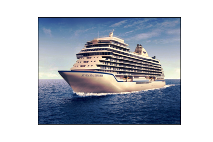

# pixel re-arranger
Python code snippet made for rearranging the pixels of an image in order to recreate another image.

The purpose is to exemplify how a Multilayer Perceptron sees "in the same way" two images, because they have the same pixels. And the distiction is easy once one takes care of pixels relative positions (CNN's).

The arrangement can be made channel by channel!!!
This means that by the same pixels, we mean the same total numbers channel by channel (independently), we can come up with new colors. Also there's a way of making it with the exact color pixels, but the results still not great.

It can be made also pixel RGB by pixel RGB. Its quite slow but the result is good. To redistribute the pixels that are very diferent, those are spread randomly through the image, and looks like salt pepper noise.

 

